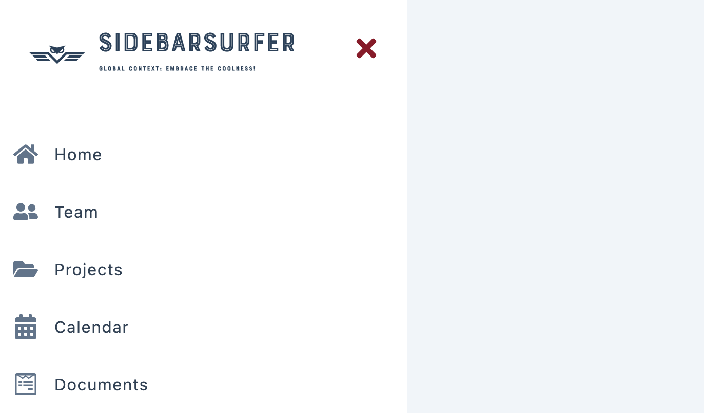

## SidebarSurfer

The Sidebar and Modal project is a responsive web application that incorporates a sidebar and modal functionality. Users can `toggle the sidebar` to access a menu of links, and `open the modal` to view additional content or perform actions. This project leverages the power of `React Context API`, utilizing global context to manage state values across components.

## Tech Stack
- `JavaScript`: The foundational programming language for creating responsive and interactive features.
- `React`: The powerful JavaScript library used to build the project: 
- - `useState` The React hook used to manage state.
- - `createContext`: The React hook used for creating a context object to share data across components in the component tree.
- - `useContext`: The React hook used to access the value provided by a context and subscribe to its changes in functional components.
- `React Icons`: The popular library that provides a vast collection of icons for enhancing the user interface and user experience in the project.

### Explore The Website
[SidebarSurfer on Netlify](https://slide-ease.netlify.app/)

### Preview

                 
